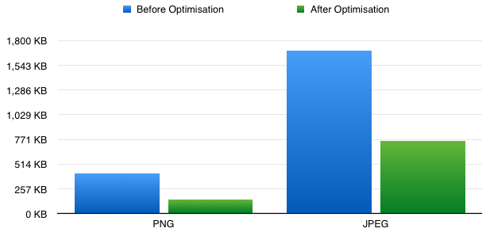
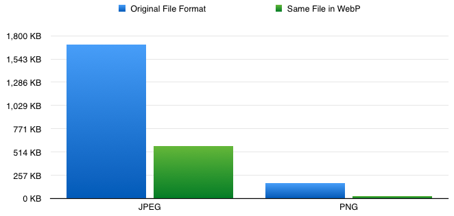

footer: Making Your Site Faster — Dan Barrett, 2015
slidenumbers: true
# Making Your Site Faster
### Serving content responsibly to your users

####    Dan Barrett — Web Developer, Humaan

---

## Current Statistics
- As of the 01/04/2015, the average page size for the Top 100 websites is 1343 KB
- Top 1000 is 1941 KB
- Mainly related to images, Flash, and JavaScript

---

## [fit] What do these results say about the current state of front-end performance?

---

## It tells us
- Top 100 websites have the time and budget to dedicate to performance

---

## If we could all be so lucky

- In the real world, deadlines and budgets can prevent us from dedicating resources to improve performance
- All sites on the HTTP Archive on the 1st of April of this year average 1950 KB in size
- Total size of websites is growing year over year (quite often content related)

^ budgets and deadlines

---

## What can _you_ do about this?

- Probably don't have a budget in the hundreds of thousands/millions
- Nor the time to dedicate weeks and people to performance testing

## Screwed?

---

# **Wrong**

---

## [fit] There are many little tips and tricks we can do

---

## Modernizr
- **Never** use the full development build in production
- Put Modernizr in the `<head>` to avoid FOUC and reflow/repaint (if using for Flexbox, or anything that would affect the critical path)
- If you need it in the `<head>`, inline it
- Split out html5shiv and conditionally load for IE 8

---

## Minimise HTTP Requests
- Most browsers allow a maximum of 8 concurrent requests per unique domain name (not IP address)
- Use sharding to split requests across the same IP address (but don't overdo it)
- Concatenate, but only include the files you actually _need_ immediately

^ define what concatenate is

^ parallel downloads and queues

^ 1 GB file / 100 x 10 MB file compare

---

## Serve Images Responsibly

- Images store unneeded comments, metadata colour profiles
- Use tools like ImageOptim, JPEGmini, and ImageAlpha
- Or use a cloud service like Kraken or EWWW IO
- Lazy load images so only images near the viewport are loaded
- Use JPEGs for photos, **not** PNGs!

---

## Image Optimisation Results

---

## Content Minification/Uglification

- Comments are great for the dev team, but not needed for the world to see
- Changes variables from `aVeryImportantVarName` to `a` automatically
- Put your `<script>` tags in the footer (or use magic)

---

## JavaScript Performance

- Don't bind directly to `scroll` & `resize` events, poll every 100ms-200ms to reduce overhead
- Avoid writing to the DOM - use variables and `if` statements to determine whether writing is necessary
- Combine alterations to a node into one DOM write/paint task (if possible)
- Use CDNs for common frameworks/libraries (i.e. jQuery, Bootstrap)

---

## [fit] Take a small amount of time to try these tips

—

## Your users will thank you!

---

## Personal Case Study

- Client with products page list - weighed in at **12.2 MB**, very slow to render
- Due to: no concatenation & minification, bad use of images (600x600 scaled down to 200x200), dead/poorly written code
- After refactor: **2.5 MB** with optimised images and minified JS/CSS (with no dead code)

---

## The Future

### it all changes...

---

## HTTP/2

- Based on Googles SPDY protocol
- Lowers the cost of multiple requests
- Multiplexes, so can send and receive data at the same time
- Sprites, inlining, and sharding no longer necessary

^ spriting et al will be bad for performance

---

## WebP & WebM

- WebP combines the best of both JPEG and PNGs
- WebM is a video container that can replace the need for gifs
- Codecs required are free and open-source

^ huge file size gains to be had

---

## Thanks

#### Slides and Reading List: [http://dan.haus/perftalk](dan.haus/perftalk)